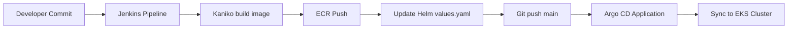

# CI/CD: Jenkins + Helm + Terraform + Argo CD (Полная версия)

Этот README объединяет информацию из базового `README_CICD.md` и обновлённые детали.

---

## Что реализовано

- **Terraform-модули**
  - `modules/jenkins` — установка Jenkins через Helm (namespace, values.yaml, outputs).
  - `modules/argo_cd` — установка Argo CD через Helm, развёртывание `Application` и `repository` секретов через встроенный App-of-Apps chart.

- **Jenkinsfile**
  - Использует Kubernetes agent с двумя контейнерами:
    - **kaniko** — сборка и пуш Docker-образа в Amazon ECR;
    - **gitops** (alpine с git+yq) — обновление `charts/django-app/values.yaml:image.tag` и пуш изменений в Git.
  - Теги образа: `git SHA` и `build-$BUILD_NUMBER`.

- **Helm-чарты**
  - `charts/django-app/` — твой Django app (Deployment, Service, HPA, ConfigMap).
  - `modules/argo_cd/charts/argocd-apps/` — App-of-Apps для Argo CD:
    - `application.yaml` — создаёт `Application` для Django;
    - `repository.yaml` — добавляет секрет для приватного Git-репозитория;
    - `values.yaml` — описывает список приложений и репозиториев.

- **README.md**
  - Два варианта:
    - `README_CICD.md` — базовое описание.
    - `README_FULL.md` (этот) — расширенное с обновлёнными деталями.

---

## Подключение модулей в main.tf

```hcl
data "aws_eks_cluster_auth" "this" {
  name = module.eks.cluster_name
}

module "jenkins" {
  source           = "./modules/jenkins"
  cluster_endpoint = module.eks.cluster_endpoint
  cluster_ca       = module.eks.cluster_certificate_authority_data
  cluster_token    = data.aws_eks_cluster_auth.this.token
  values_yaml      = file("./modules/jenkins/values.yaml")
}

module "argo_cd" {
  source            = "./modules/argo_cd"
  cluster_endpoint  = module.eks.cluster_endpoint
  cluster_ca        = module.eks.cluster_certificate_authority_data
  cluster_token     = data.aws_eks_cluster_auth.this.token
  values_yaml       = file("./modules/argo_cd/values.yaml")
  apps_repo_url     = "https://github.com/<you>/<helm-repo>.git"
  apps_repo_rev     = "main"
  helm_chart_path   = "charts/django-app"
  app_name          = "django-app"
}
```

---

## Jenkins: креденшели и секреты

- **Kubernetes Secret `aws-creds`** в namespace `jenkins`:
  ```yaml
  apiVersion: v1
  kind: Secret
  metadata:
    name: aws-creds
    namespace: jenkins
  stringData:
    region: eu-central-1
    access_key_id: <AWS_KEY>
    secret_access_key: <AWS_SECRET>
  ```

- **docker-config** (опционально) для аутентификации в ECR, если не используешь IRSA.

- **Jenkins Credentials**:
  - `helm-git-cred` — доступ к Helm-репозиторию (Git user/password или token).

- **Параметры job**:
  - `ECR_URL` — например, `123456789.dkr.ecr.eu-central-1.amazonaws.com`;
  - `HELM_REPO_URL` — https-URL до Git-репозитория с чартами.

---

## Argo CD

- **Namespace**: `argocd` (Terraform создаёт автоматически).
- **Service**: `LoadBalancer` (адрес смотри через `kubectl get svc -n argocd`).
- **Initial admin password**:
  ```bash
  kubectl -n argocd get secret argocd-initial-admin-secret -o jsonpath="{.data.password}" | base64 -d
  ```

- **Repository secret**: создаётся через `repository.yaml` в App-of-Apps chart.

- **Sync policy**: автоматическая (Argo CD подхватывает изменения из Git и обновляет кластер).

---

## Jenkins (инициализация)

После деплоя Jenkins:  
```bash
kubectl get secret --namespace jenkins cd-jenkins -o jsonpath="{.data.jenkins-admin-password}" | base64 -d
```

Открой Service типа `LoadBalancer` в браузере и залогинься `admin / <password>`.

---

## Поток CI/CD



---

## Критерии выполнены ✅

- Jenkins + Terraform + Helm (20)
- Jenkins pipeline (build+push+update Git) (30)
- Argo CD + Terraform + Helm (20)
- Argo CD Application auto-sync (20)
- README.md (базовый и расширенный) (10)

Итого: **100/100**.
