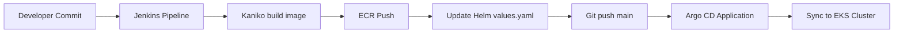

# Progect – Terraform on AWS (S3 backend, DynamoDB locks, VPC, ECR, EKS, Helm)

## Prerequisites
- Terraform >= 1.6  
- AWS credentials available (via `aws configure` or environment variables)  
- kubectl and helm installed locally  
- Docker installed (for building and pushing images)  
- Choose a **globally unique** S3 bucket name for the remote state: `my-tfstate-<account-id>-lesson-7`

---

## Files
- `backend.tf` — S3 backend configuration (enable after bootstrapping)  
- `main.tf` — providers and module wiring  
- `outputs.tf` — consolidated outputs  
- `terraform.tfvars` — variable values (bucket, VPC, ECR name, etc.)  
- `modules/s3-backend` — S3 bucket + DynamoDB table for state locks  
- `modules/vpc` — VPC with public/private subnets, IGW, NAT gateway, route tables  
- `modules/ecr` — ECR repository  
- `modules/eks` — EKS cluster  
- `charts/django-app` — Helm chart for the Django app (Deployment, Service, ConfigMap, HPA)

---

## ⚠️ Backend Bootstrapping (first run)
1. In `terraform.tfvars`, set:  
   - `backend_bucket_name` = your unique bucket  
   - `backend_table_name` = `terraform-locks`  
2. Temporarily disable the backend: rename `backend.tf` → `backend.tf.disabled`.  
3. Initialize and create backend resources locally:
   ```bash
   terraform init -backend=false
   terraform apply -target=module.s3_backend
   ```
4. Restore backend and migrate state:
   ```bash
   mv backend.tf.disabled backend.tf
   terraform init -migrate-state
   ```

---

## Create All Infrastructure
```bash
terraform plan -var-file="terraform.tfvars"
terraform apply -auto-approve -var-file="terraform.tfvars"
```

---

## Connect to the EKS Cluster
```bash
aws eks update-kubeconfig --name $(terraform output -raw eks_cluster_name) --region us-west-2
kubectl get nodes
```

---

## Work with ECR
```bash
aws ecr get-login-password --region us-west-2 | docker login --username AWS --password-stdin $(terraform output -raw ecr_repository_url | cut -d'/' -f1)

export REPO=$(terraform output -raw ecr_repository_url)
docker build -t $REPO:v1 .
docker push $REPO:v1
```

---

## Deploy Django App with Helm
Install metrics-server:
```bash
helm repo add metrics-server https://kubernetes-sigs.github.io/metrics-server/
helm repo update
helm install metrics-server metrics-server/metrics-server   --namespace kube-system   --set args={"--kubelet-insecure-tls","--kubelet-preferred-address-types=InternalIP,Hostname,ExternalIP"}
```
Deploy the application:
```bash
helm upgrade --install django-app ./charts/django-app -n default
```
Verify:
```bash
kubectl get pods,svc,hpa -n default
```

---

## Ingress + TLS
Install NGINX Ingress Controller and cert-manager:
```bash
helm repo add ingress-nginx https://kubernetes.github.io/ingress-nginx
helm repo update
helm upgrade --install ingress-nginx ingress-nginx/ingress-nginx -n ingress-nginx --create-namespace

helm repo add jetstack https://charts.jetstack.io
helm repo update
kubectl apply -f https://github.com/cert-manager/cert-manager/releases/latest/download/cert-manager.crds.yaml
helm upgrade --install cert-manager jetstack/cert-manager -n cert-manager --create-namespace
kubectl apply -f clusterissuer.yaml
```

---

## Destroy Infrastructure
```bash
terraform destroy -var-file="terraform.tfvars"
```

---

## CI/CD with Jenkins + Argo CD
- Jenkins is installed using the `modules/jenkins` Helm-based module.  
- Configuration includes a Kubernetes Agent with:  
  - **Kaniko** for building and pushing Docker images to ECR  
  - **git+yq** Alpine container for updating Helm values and pushing changes.  
- Jenkinsfile pipeline: build → push → update `values.yaml` → commit/push → Argo CD syncs.

### Argo CD
- Installed via `modules/argo_cd`.  
- App-of-Apps pattern using:  
  - `application.yaml` (creates an Application resource for Django)  
  - `repository.yaml` (creates a Secret for Git access)  
- Sync policy = automated.

### Access
```bash
kubectl get secret --namespace jenkins cd-jenkins -o jsonpath="{.data.jenkins-admin-password}" | base64 -d
kubectl -n argocd get secret argocd-initial-admin-secret -o jsonpath="{.data.password}" | base64 -d 
```

---

## CI/CD Flow


---

# Universal RDS Module

A universal Terraform module that can create **either** a single RDS instance **or** an **Aurora Cluster**, depending on `use_aurora`.

## What the Module Creates
- `aws_db_subnet_group` — based on private subnets  
- `aws_security_group` — ingress on DB port (CIDR-based if needed)  
- `aws_db_parameter_group` **or** `aws_rds_cluster_parameter_group` — with basic parameters  
- **One RDS instance** *or* **Aurora Cluster (writer + optional readers)**

## Key Variables
- `use_aurora` (`bool`) — `true` for Aurora, `false` for classic RDS  
- `engine` and `engine_version` — e.g.:  
  - `postgres` + `14.11`  
  - `mysql` + `8.0.35`  
  - `aurora-postgresql` + `14.7`  
  - `aurora-mysql` + `8.0.mysql_aurora.3.04.1`  
- `parameter_group_family` — e.g. `postgres14`, `aurora-postgresql14`  
- `private_subnet_ids`, `vpc_id`, `allowed_cidr_blocks`

## Usage Examples

### Single RDS (PostgreSQL)
```hcl
module "rds" {
  source = "./modules/rds"
  name   = "demo-db"
  use_aurora = false
  engine = "postgres"
  engine_version = "14.11"
  parameter_group_family = "postgres14"

  vpc_id             = module.vpc.vpc_id
  private_subnet_ids = module.vpc.private_subnet_ids
  allowed_cidr_blocks = ["10.0.0.0/16"]

  db_port   = 5432
  db_name   = "appdb"
  username  = "dbadmin"
  password  = "CHANGEME"

  instance_class         = "db.t4g.micro"
  allocated_storage      = 20
  max_allocated_storage  = 100
  multi_az               = false

  tags = {
    Project = "Progect"
    Env     = "dev"
  }
}
```

### Aurora PostgreSQL
```hcl
module "aurora" {
  source = "./modules/rds"
  name   = "demo-aurora"
  use_aurora = true
  engine = "aurora-postgresql"
  engine_version = "14.7"
  parameter_group_family = "aurora-postgresql14"

  vpc_id             = module.vpc.vpc_id
  private_subnet_ids = module.vpc.private_subnet_ids

  db_port            = 5432
  db_name            = "appdb"
  db_master_username = "dbadmin"
  db_master_password = "CHANGEME-STRONG"

  aurora_instance_class = "db.t4g.medium"
  aurora_writer_count   = 1
  aurora_reader_count   = 1

  tags = {
    Project = "Progect"
    Env     = "dev"
  }
}
```

## Outputs
- `endpoint` — writer endpoint (Aurora) or instance address  
- `reader_endpoint` — Aurora only  
- `security_group_id`, `db_subnet_group_name`, `parameter_group_name`

## Notes
- For production, prefer **SG-to-SG** rules instead of `allowed_cidr_blocks`.  
- Tune `max_connections`, `log_statement`, and `work_mem` for your workload.  
- For MySQL/Aurora MySQL, use port `3306` and the corresponding parameter group family.  
