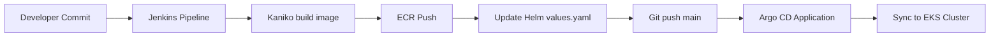

# lesson-7 — Terraform on AWS (S3 backend, DynamoDB locks, VPC, ECR, EKS, Helm)

## Prerequisites
- Terraform >= 1.6
- AWS credentials available in your shell (e.g. via `aws configure` or environment variables)
- kubectl and helm installed locally
- Docker installed (for building and pushing images)
- Choose a **globally-unique** S3 bucket name for state, e.g. `my-tfstate-<account-id>-lesson-7`

---

## Files
- `backend.tf` — S3 backend configuration (enable AFTER bootstrapping)
- `main.tf` — providers + module wiring
- `outputs.tf` — consolidated outputs
- `terraform.tfvars` — variable values (bucket, vpc, ecr_name, etc.)
- `modules/s3-backend` — S3 bucket (versioned) + DynamoDB table for state locks
- `modules/vpc` — VPC with 3 public + 3 private subnets, IGW, single NAT GW, shared RTs
- `modules/ecr` — ECR repository with scan-on-push and a minimal policy
- `modules/eks` — EKS cluster with worker nodes
- `charts/django-app` — Helm chart for the Django app (Deployment, Service, ConfigMap, HPA)

---

## ⚠️ Backend bootstrapping (first run)
1. Edit `terraform.tfvars` and set:
   - `backend_bucket_name` = your unique bucket  
   - `backend_table_name` = `terraform-locks` (or your preferred name)

2. **Temporarily disable** the remote backend by renaming `backend.tf` to `backend.tf.disabled` (or comment its contents).

3. Init and create only the backend resources locally:
```bash
terraform init -backend=false
terraform apply -target=module.s3_backend
```

4. Restore `backend.tf` and initialize remote state, migrating automatically:
```bash
mv backend.tf.disabled backend.tf
terraform init -migrate-state
```

---

## Create all infrastructure
```bash
terraform plan -var-file="terraform.tfvars"
terraform apply -auto-approve -var-file="terraform.tfvars"
```

---

## Connect to EKS cluster
```bash
aws eks update-kubeconfig --name $(terraform output -raw eks_cluster_name) --region us-west-2
kubectl get nodes
```

---

## ECR usage

- Authenticate Docker to ECR
```bash
aws ecr get-login-password --region us-west-2 \
| docker login --username AWS --password-stdin $(terraform output -raw ecr_repository_url | cut -d'/' -f1)
```

- Build & push an image
```bash
export REPO=$(terraform output -raw ecr_repository_url)
docker build -t $REPO:v1 .
docker push $REPO:v1
```

---

## Deploy Django app with Helm

- Install metrics-server (required for HPA)
```bash
helm repo add metrics-server https://kubernetes-sigs.github.io/metrics-server/
helm repo update
helm install metrics-server metrics-server/metrics-server \
  --namespace kube-system \
  --set args={"--kubelet-insecure-tls","--kubelet-preferred-address-types=InternalIP,Hostname,ExternalIP"}
```
- Deploy the application
```bash
helm upgrade --install django-app ./charts/django-app -n default
```

- Verify resources
```bash
kubectl get pods,svc,hpa -n default
```

---

## Ingress + TLS (NGINX Ingress Controller + cert-manager)

- NGINX Ingress Controller
```bash
helm repo add ingress-nginx https://kubernetes.github.io/ingress-nginx
helm repo update
helm upgrade --install ingress-nginx ingress-nginx/ingress-nginx -n ingress-nginx --create-namespace
```

- Cert-manager
```bash
helm repo add jetstack https://charts.jetstack.io
helm repo update
kubectl apply -f https://github.com/cert-manager/cert-manager/releases/latest/download/cert-manager.crds.yaml
helm upgrade --install cert-manager jetstack/cert-manager -n cert-manager --create-namespace
```

- ClusterIssuer (Let's Encrypt)
```bash
kubectl apply -f clusterissuer.yaml
```

---

## Destroy
```bash
terraform destroy -var-file="terraform.tfvars"
```


---

# CI/CD with Jenkins + Argo CD

## Jenkins + Terraform + Helm

- Jenkins is installed via the Terraform module `modules/jenkins`, which uses the Helm chart.
- The configuration includes a Kubernetes Agent with two containers:
- **kaniko** — for building and publishing a Docker image to Amazon ECR;
- **gitops** — Alpine with git+yq, used to update the Helm chart and push changes to Git.

### Jenkinsfile (pipeline)
1. Checkout the source code.
2. Kaniko builds the Docker image and pushes it to ECR (tags: `git SHA` and `build-$BUILD_NUMBER`).
3. Update `charts/django-app/values.yaml:image.tag` in the Helm repository.
4. Commit + push to `main`.
5. Argo CD automatically synchronizes changes to the cluster.

## Argo CD + Terraform + Helm

- Argo CD is installed via the Terraform module `modules/argo_cd`.
- App-of-Apps approach is used:
- `application.yaml` creates an Application resource for the Django application;
- `repository.yaml` creates a Secret to access the Git repository.
- Sync policy = **automated** (Argo CD immediately pulls changes from Git).

### Access
- Jenkins:
```bash
kubectl get secret --namespace jenkins cd-jenkins -o jsonpath="{.data.jenkins-admin-password}" | base64 -d
```
- Argo CD:
```bash
kubectl -n argocd get secret argocd-initial-admin-secret -o jsonpath="{.data.password}" | base64 -d 
```

## CI/CD flow



